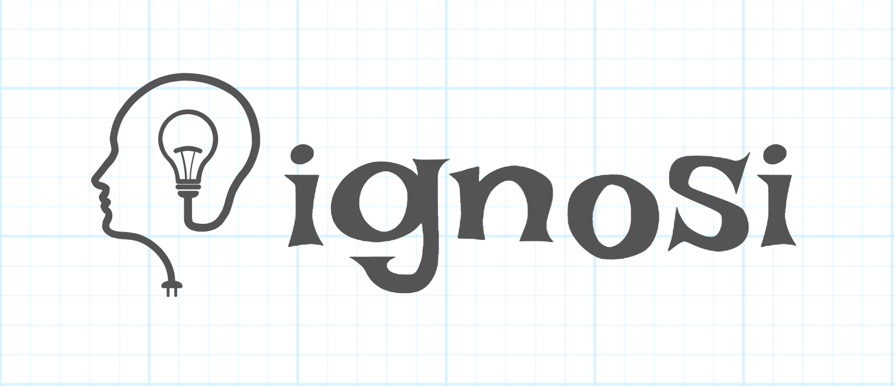

# ignosi

  

η γνώση
Γνώση είναι η μετεξέλιξη στον νου της καταγεγραμμένης πληροφορίας και εμπειρίας που παρέχει την εξοικείωση, την αντιληπτότητα και την κατανόηση των πραγμάτων και δίνει επιδεξιότητα και δυνατότητα καθοδήγησης στη λήψη αποφάσεων. Αποκτάται μέσω της εμπειρίας ή της εκπαίδευσης με την πρόσληψη πληροφορίας, την ανακάλυψη και τη μάθηση.

Knowledge is the transformation into the mind of recorded information and experience that provides familiarity, perception and understanding of things, and gives dexterity and guidance to decision-making. It is gained through experience or education through information acquisition, discovery and learning.
